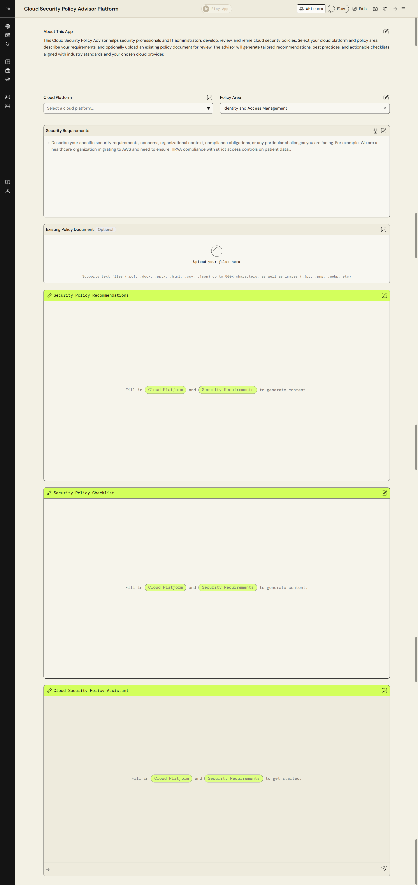

# 🛡️ AWS Cloud Security Policy Advisor


<div align="center">

[](https://opensource.org/licenses/MIT)
[](https://partyrock.aws/)
[]()
[]()

**[Live App (PartyRock)](#) • [Report Bug](https://github.com/l9rins/aws-cloud-security-policy-advisor/issues) • [Request Feature](https://github.com/l9rins/aws-cloud-security-policy-advisor/issues)**

</div>

---

## 🚀 Overview

**AWS Cloud Security Policy Advisor** is an AI-powered tool built on **AWS PartyRock** that instantly generates customized, production-ready cloud security checklists and policies. It helps startups and enterprises secure their AWS environments by producing actionable, prioritized security steps based on industry best practices (CIS Foundations, SOC 2, AWS Well-Architected).

Whether you're deploying your first EC2 instance or auditing an entire organization's IAM policies, this advisor cuts through the complexity of AWS security documentation to give you exactly what you need.

> "Stop guessing your cloud security posture. Start securing your infrastructure."

---

## ✨ Features

*   **Intelligent Policy Generation:** Automatically constructs comprehensive security checklists tailored to your specific architecture (e.g., S3, EC2, RDS).
*   **Prioritized Action Plans:** Categorizes tasks into Immediate (Quick Wins), Short-Term, and Long-Term strategic actions.
*   **Compliance Ready:** Maps security controls directly to CIS AWS Foundations Benchmark v1.5 and SOC 2 CC6 Controls.
*   **Copy-Paste Remediation:** Provides exact JSON IAM policies, bucket policies, and AWS CLI commands for instant remediation.
*   **Common Pitfalls:** Highlights top misconfigurations to avoid (e.g., wildcard resource policies, exposed ports).

---

## 🧠 Prompt Design

The core of this application runs on a carefully engineered system prompt designed to enforce structured, high-quality output from the foundational model. 

### System Prompt Strategy
The prompt is engineered using the following principles:
1. **Persona Adoption:** The AI assumes the role of a Principal AWS Cloud Security Architect.
2. **Contextual Grounding:** It strictly aligns outputs with the AWS Well-Architected Framework (Security Pillar).
3. **Structured Output:** Enforces a rigid Markdown structure including actionable checkboxes, CLI commands, and IAM JSON snippets.
4. **Tone:** Professional, authoritative, and concise.

*(You can explore a sample output in the `sample-output/security-checklist-example.md` file.)*

---

## 📂 Repository Structure

```text
/aws-cloud-security-policy-advisor
  ├── README.md                                  # Project overview and prompt design
  ├── sample-output/
  │   └── security-checklist-example.md          # Example of an AI-generated security policy
  └── screenshots/
      └── partyrock-app.png                      # App interface screenshots
```

---

## 📸 Screenshots

*(Add screenshots of the PartyRock application in action here)*

<div align="center">
  
</div>

---

## 🤝 Contributing

Contributions, issues, and feature requests are welcome! 

1.  **Fork** the repository.
2.  Create your **Feature Branch** (`git checkout -b feature/AmazingFeature`).
3.  **Commit** your changes (`git commit -m 'Add some AmazingFeature'`).
4.  **Push** to the branch (`git push origin feature/AmazingFeature`).
5.  Open a **Pull Request**.

---

<div align="center">

**Built with ❤️ by [Mark Lorenz](https://github.com/l9rins)**

Licensed under [MIT](./LICENSE) © 2026

</div>
